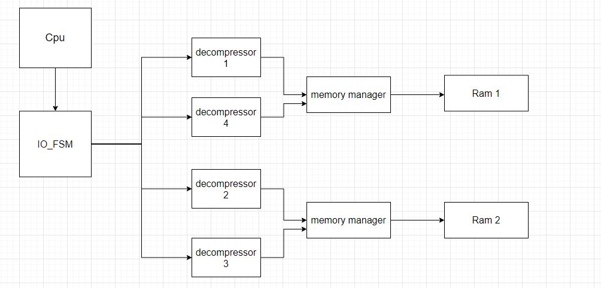

# IO Module

## Schematic Desgin

## Run Module
Make sure that your base directory is ODE_Accelerator. Then, run the following commands:
1. Run CPU simulation
  - source CPU/CPU.tcl
2. Run testbenches For subModules
  - do IO\ module/decompressor.test.tcl
  - Simulate IO\ module/io_fsm_testbench.v
  - Simulate IO\ module/memory_manage_testbench.v
Only error messages are printed in console.
